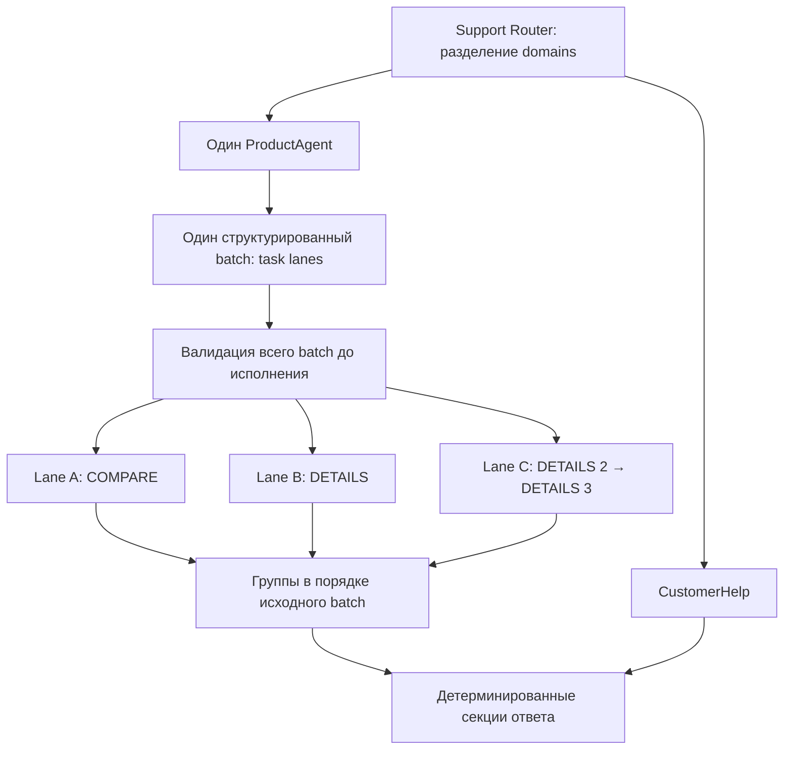

# Product multi-action: реализация и проверка

Дата: 2026-10-05. Ветка: `astra/product-multi-action`.
Проверенная исходная точка: `febe13bbdb5120ae497a8cf01a8f9a7fe13e09b1`.
Работа выполнена в отдельном checkout `product-multi-intent`; исходный `refactor-guest` с пользовательскими изменениями не редактировался.

## 1. Audit

До изменений ProductAgent уже имел две стадии: `decideProduct` и `executeProductDecision`. Workspace содержал отдельные задачи, каждая со своим `ConsultationApplicationRecord`, SearchSpec и ResultsState. Внутри исполнения использовался `Promise.all`, но одна операция содержала только один decision. Защита от повторной адресации задачи запрещала два DETAILS одной подборки за один turn.

Другие обнаруженные ограничения:

- Один parent requestId передавался WriteOwner: при последовательных действиях второй write мог стать duplicate.
- Группа имела единственную `consultation`; сохранение двух DETAILS или COMPARE → DETAILS отсутствовало.
- Product worker фильтровал группы без карточек поиска. Это правильно для старого UI, но теряло отдельные результаты действий при отсутствии общего контракта.
- Нулевая выдача заканчивалась общей фразой без проверки альтернатив.
- Активный planner ограничивал operations пятью. Исторические схемы и `applyProductPlan` сохраняли ограничения на needs и автоматическое вытеснение старых задач.
- RequestRouter уже имел восстановление пропущенного намерения CustomerHelp. Его переписывание для этой задачи не потребовалось.

Исходный Jest baseline проверен до реализации: Product/Support — 67 suites, 426 tests; Order — 3 suites, 11 tests.

## 2. Фактическая архитектура



Одна consult operation теперь содержит `actions: [{ decision, view }]`. В пределах задачи actions выполняются через последовательный `await`. Следующий action получает record, который вернул предыдущий. Lanes выполняются параллельно; общие изменяемые records не передаются. Повторная lane для одной задачи отклоняется до запуска.

Полная структура batch, ownership, комбинации action/selection/searchPatch, cardinality и доступные семантические проверки выполняются заранее. Используются те же Core-правила через `assertConsultationProposalStructure` и `prepareConsultationTurn`. Непродуктовые изменения SearchSpec можно проверить и после запланированного поиска; ссылки на будущие товары разрешаются перед соответствующим action по фактическому новому snapshot. Временное состояние предварительной проверки не записывается.

WriteOwner остаётся единственным владельцем принятия изменений. Ошибка action сохраняет последний возвращённый record и останавливает остаток этой lane. Соседние lanes завершаются независимо; их результаты сохраняются. Порядок ответа определяется порядком входных lanes и действий, а не скоростью завершения.

REPLACE / APPEND / CONTINUE сохранены. Новый самостоятельный поиск заменяет текущий рабочий контекст; «а ещё» добавляет задачу; follow-up продолжает существующую. Управлять внутренней ёмкостью подборок пользователь не должен.

## 3. Send или Promise.all

Выбран управляемый `Promise.all` **между lanes**, последовательный цикл — внутри каждой lane.

Текущий Product subgraph компилируется без собственного checkpointer и имеет обычные одиночные state channels, а не reducers для нескольких параллельных результатов. Введение Send потребовало бы отдельных lane input/output channels, reducers, согласования aggregation и checkpoint boundaries. Сам Send не делает каждый внутренний action отдельной долговечной транзакцией.

Для нынешнего двухстадийного графа отдельная функция lane executor даёт нужную изоляцию без новой системы хранения и merge records. Внешний Support fan-out между domains по-прежнему использует существующий Send и reducer workerResults.

Основание для оценки Send/reducers: [официальный LangGraph Graph API](https://docs.langchain.com/oss/javascript/langgraph/graph-api). Выбор для этого проекта — инженерный вывод из его текущего кода, а не утверждение, что Promise.all универсально лучше Send.

Если понадобится независимо возобновлять lanes после падения процесса, стоит отдельно проектировать persisted lane execution и checkpoint/retry protocol. Простая замена Promise.all на Send этого не гарантирует.

## 4. Child idempotency

Workspace сохраняет исходный requestId. Повтор уже обработанного turn пропускает planner, searches и actions; новые presentations не создаются.

Для каждого action backend вычисляет:

```text
childRequestId = "product-action-" + SHA256(JSON.stringify([
  parentRequestId, taskId, actionOrdinal
]))
```

Ordinal начинается с нуля и относится к порядку actions lane. Одинаковые входные значения дают одинаковый ID; разные действия одной задачи получают разные IDs. Модель эти IDs не генерирует. Они передаются существующему WriteOwner вместе с актуальной revision.

Существующий журнал replay ограничен последними 128 request IDs. Это окно идемпотентности, а не ограничение числа Product tasks/actions. Гарантия касается повторов с сохранённым workspace; exactly-once после аварии до внешнего checkpoint не заявляется.

## 5. Multiple presentations

Внутренний результат задачи:

```typescript
{
  taskId, query, status, products,
  presentations: [
    { actionOrdinal: 0, kind: 'comparison', data: comparisonPresentation },
    { actionOrdinal: 1, kind: 'details', data: productDetailsPresentation },
    { actionOrdinal: 2, kind: 'recommendation', message, productIds }
  ],
  recovery?: { resultId, options, question }
}
```

Presentations строятся из успешного результата каждого action, а не из последнего snapshot задачи. Поэтому последующий REFINE не подменяет IDs уже подготовленной рекомендации. DETAILS остаётся действием ровно над одним товаром; два товара — два DETAILS. COMPARE требует минимум два.

На публичной границе Product worker все результаты доступны в `resultGroups`. Старое поле `groups` — только производная проекция групп с реальными карточками поиска. Таким образом, пустая выдача и DETAILS-only не создают пустую search card. Клиент должен читать `resultGroups[].presentations` для нескольких представлений; изменение frontend в эту работу не входит.

`consultation` оставлено как совместимый адаптер для одиночного action. Это не второй persisted state; при нескольких actions поле null. Evaluation собирает артефакты из presentations с ключом `taskId:actionOrdinal`, не дублируя их через старое поле.

COMPARE → RECOMMEND работает в одном и в разных turns: `view=focus` использует выбранные для сравнения товары и их порядок. Дополнительный SEARCH не запускается. RECOMMEND использует существующие ProductFacts и semantic evidence; SEARCH/DETAILS/COMPARE не получают response-LLM.

## 6. Grounded zero-result recovery

После успешного SEARCH/REFINE с нулём товаров:

1. Берётся принятый SearchSpec и CategoryProfile. В profile добавлен необязательный упорядоченный список `searchRelaxationAttributeIds`; неизвестные атрибуты отклоняет profile schema. Профили текущего магазина разрешают цвет, бренд и цену. Алгоритм не содержит ветвления по одежде/обуви или конкретному атрибуту.
2. Из каждого разрешённого ограничения строится отдельный candidate: снимается ровно один selector `attributeId + operator`. Категория и остальные constraints сохраняются. Critical attributes исключены даже при ошибочном включении в policy.
3. Из semanticIntent удаляется только совпадающее целое строковое значение снятого условия. Сохраняются тип/назначение и остальные слова. Пустой intent не заменяется широкой категорией: такой candidate пропускается. Неизвестные синонимы остаются мягким предпочтением поиска; это консервативное ограничение, описанное ниже.
4. Candidate проходит existing profile validation, проверку stale structured literals и adapter validation.
5. Максимум **три диагностических search I/O на пустой snapshot** выполняются параллельно через тот же ProductSearchPort. Это локальный бюджет диагностики, не пользовательская ёмкость tasks/actions. Комбинации снятых условий не перебираются.
6. В options попадают только searches, вернувшие реальные товары. Пустой или упавший probe не создаёт предложения. Если подтверждённых options нет, задаётся честный вопрос о допустимом изменении запроса.
7. Probes не вызывают WriteOwner, не меняют SearchSpec/Memory/active/lastConfirmed и не превращаются в пользовательскую выдачу. Availability остаётся ответственностью существующего поиска до AI.
8. В существующем `task.question` сохраняется вопрос с подтверждёнными вариантами. Ответ пользователя интерпретируется обычным REFINE этой задачи. Нового альтернативного authoritative SearchSpec или recovery planner нет.

Формулировка намеренно сообщает проверенное: «Поиск нашёл варианты при снятии ограничения…». Она не утверждает конкретный новый цвет, бренд, количество товаров в каталоге или доступность в будущем.

## 7. Удаление исторической пятёрки

| Файл | Удалённое ограничение |
|---|---|
| `application/workspace/product-workspace-plan.ts` | MAX_PRODUCT_OPERATIONS_PER_TURN и operations.max(5) |
| `application/workspace/product-workspace.prompt.ts` | Инструкция «максимум пять» |
| `application/context/product-context.schema.ts` | needs.max(5) в V2 и legacy input |
| `src/support-agent/schemas/product-context.schema.ts` | Те же ограничения совместимых Support schemas |
| `application/agent/legacy-product-agent.state.ts` | max(5) для activeNeedIds, searchNeedIds, searchResults |
| `application/planner/product-planner-result.schema.ts` | Верхняя граница NeedIndex; max(5) для updates/remove/reuse |
| `application/planner/product-plan.ts` | Вытеснение старых needs при переполнении и capacity exception |
| `application/session/consultation-lifecycle.schema.ts` | needIds.max(5) |
| `application/consultation-agent/schemas/consultation-agent.schema.ts` | searches.max(5), decisions.max(5) |
| `application/consultation-agent/schemas/consultation-completion.schema.ts` | decisions.max(5) |

Пути `application/...` в таблице начинаются с `src/product-consultation/`.
Workspace tasks/focus уже не имели этой ёмкости на стартовом commit. Ограничения на количество конкретных товаров в выдаче, позиции и semantic evidence оставлены: это другой смысл, не ёмкость задач. Legacy ProductNeed/NeedIndex удалены только из capacity semantics; они не возвращены в active graph/evaluation.

Для патологического ответа модели у batch есть проверка размера JSON 256 KiB; новый лимит на число tasks/actions не вводился. Существующий внешний Product node timeout 60 секунд сохранён.

## 8. Cross-domain и acceptance tests

| Сценарии | Доказательство |
|---|---|
| A, C: три независимых поиска | Барьеры: все три search начались до освобождения; освобождение в обратном порядке; output и constraints остаются изолированными |
| B, D, G: COMPARE / DETAILS / два DETAILS | Соседние lanes стартуют параллельно; второй DETAILS шорт ждёт первый; WriteOwner получает следующую revision; оба presentation сохранены |
| E: child replay | Три разных backend child IDs; повтор parent не вызывает planner, write, search или capability повторно |
| F: partial failure | Первое действие сохранено, среднее падает, третье не запускается; соседняя задача завершается |
| H: COMPARE → DETAILS | Оба presentation сохранены в порядке actions |
| I: COMPARE → RECOMMEND | В одном и разных turns выбираются те же товары в порядке focus; посторонняя задача не изменяется; нового search нет |
| J: нулевая выдача | Оба успешных probe; пустой probe; исключение probe; все пустые; подтверждённый выбор REFINE; generic policy/material/price/critical attributes |
| K: zero + доставка | Настоящие Router/dispatch/workers/aggregation, mock модели и search; Router-модель пропускает доставку, recovery восстанавливает её; секции и options сохраняются; пустых search groups нет |
| L: Product → CustomerHelp → Product | Тестовый Support StateGraph с MemorySaver: workspace после delivery-only равен сохранённому; follow-up продолжает прежний taskId без поиска |
| M: больше пяти | Семь lanes в turn; APPEND восьмой без удаления старых; семь DETAILS одной task; самостоятельный новый SEARCH снова делает REPLACE |
| Multi-action + CustomerHelp | Три Product lanes с четырьмя actions и отдельный ответ о доставке в одном turn; ProductAgent вызывается один раз на turn |
| False positive delivery | «Кроссовки для работы в доставке» не запускает CustomerHelp |
| Batch preflight | Неверная cardinality, отсутствующая selection, запрещённый searchPatch, смена категории после SEARCH и повторный SEARCH отклоняются до I/O |

Cross-domain тест использует реальные узлы и reducers, но MemorySaver вместо Postgres и mock CustomerHelp/model/search. Реальная БД не запускается. Existing assertions не ослаблялись; в старых workspace tests только fixtures переведены на actions[]. Добавлен отдельный тест отмены legacy eviction; тест явного удаления старой задачи сохранён.

## 9. Изменённые файлы

Production и evaluation adapter:

```text
src/product-consultation/application/agent/agreagte-answer.schema.ts
src/product-consultation/application/agent/legacy-product-agent.state.ts
src/product-consultation/application/agent/nodes/execute-product-decision.node.ts
src/product-consultation/application/agent/nodes/execute-product-workspace.node.ts
src/product-consultation/application/consultation-agent/schemas/consultation-agent.schema.ts
src/product-consultation/application/consultation-agent/schemas/consultation-completion.schema.ts
src/product-consultation/application/context/product-context.schema.ts
src/product-consultation/application/planner/product-plan.ts
src/product-consultation/application/planner/product-planner-result.schema.ts
src/product-consultation/application/presentation/product-action-presentations.ts
src/product-consultation/application/search/zero-result-recovery.ts
src/product-consultation/application/session/consultation-lifecycle.schema.ts
src/product-consultation/application/workspace/execute-product-lane.ts
src/product-consultation/application/workspace/product-workspace-plan.ts
src/product-consultation/application/workspace/product-workspace.prompt.ts
src/product-consultation/core/consultation-core.schema.ts
src/product-consultation/core/profiles/accessories.profile.ts
src/product-consultation/core/profiles/clothes.profile.ts
src/product-consultation/core/profiles/shoes.profile.ts
src/product-consultation/core/turn/consultation-turn-boundary.ts
src/product-consultation/evaluation/targets/current-product-consultation.target.ts
src/support-agent/graph/nodes/aggregate-final-answer.node.ts
src/support-agent/graph/workers/product-agent.worker.ts
src/support-agent/schemas/product-context.schema.ts
```

Тесты и общий test fixture:

```text
src/product-consultation/application/planner/product-plan.spec.ts
src/product-consultation/application/search/zero-result-recovery.spec.ts
src/product-consultation/application/workspace/product-multi-action.spec.ts
src/product-consultation/application/workspace/product-workspace.spec.ts
src/product-consultation/application/workspace/product-workspace-target-normalization.spec.ts
src/product-consultation/application/workspace/product-workspace.test-fixtures.ts
src/support-agent/graph/nodes/tests/product-multi-action-cross-domain.spec.ts
src/support-agent/graph/workers/tests/product-agent-presentation.spec.ts
```

Документ: `docs/product-multi-action-report.md`.

## 10. Результаты проверок

| Команда | Результат |
|---|---|
| `npx jest src/product-consultation src/support-agent --runInBand --silent` | 70 suites PASS, 455 tests PASS |
| `npx jest src/modules/orders --runInBand --silent` | 3 suites PASS, 11 tests PASS |
| `git diff --check` | clean |

Итого 73 suites и 466 tests. Product/Support увеличился на 3 suites и 29 tests относительно проверенного baseline. `--silent` скрывает console output, не меняя набор проверок.

Дополнительно выполнен `tsc --noEmit --incremental false`. Он не показал ошибок в изменённых файлах, но весь typecheck не зелёный: восемь TS2345 в двух Order test files и одна TS2493 в `product-agent-source-query.spec.ts:93`. Эти три файла не отличаются от `febe13b`; в соседние тесты изменения не вносились. Полный исходный commit отдельно этим typecheck не прогонялся, поэтому это не заявляется как отдельно воспроизведённый baseline TypeScript.

`npm run build`, live Yandex/LLM evaluation, реальные поиски каталога и мутации Postgres/Qdrant/Redis не запускались.

## 11. Коммиты

1. `bd70308b6df5686c22ec69236946e11be33581c5` — `product: support ordered multi-action task lanes`.
2. `aaba419fa3e3c6a51491e2dabcea0400bef51d91` — `product: support multiple ordered presentations`.
3. Коммит, добавляющий этот документ — `product: add grounded zero-result recovery and remove legacy capacity limits`. Его точный SHA указан в итоговом сообщении и истории ветки; документ не содержит собственного ещё не созданного hash.

Каждый логический commit отправляется только в `origin/astra/product-multi-action`. Main, история основной ветки, merge/rebase/force push не используются.

## 12. Реальные ограничения и следующие небольшие улучшения

- Offline tests доказывают исполнение, изоляцию и state/presentation contracts при заданных решениях модели. Они не измеряют качество распознавания естественных фраз живой моделью и качество реального retrieval.
- Гарантия последовательности относится к actions одной lane внутри batch. Новая распределённая блокировка одновременных пользовательских turns одного conversation не добавлена.
- Lanes не являются отдельными durable checkpoints. Падение до сохранения внешнего graph state может повторить работу; журнал IDs ограничен 128. Для crash-safe resume нужен отдельный протокол сохранения принятых action outcomes.
- Recovery ограничен разрешёнными profile attributes и тремя одиночными probes. Он может не найти существующую альтернативу, требующую двух изменений. Синонимы/склонения снятого условия в semanticIntent могут сохраняться как мягкое retrieval-предпочтение; произвольное NLP-переписывание запроса не добавлено.
- Доказательство recovery актуально на момент probe. После ответа пользователя выполняется новый обычный поиск; наличие не резервируется. Ошибка probe не трактуется как доказательство отсутствия товара во всём каталоге.
- Тексты вопроса сохраняются через существующий task.question; специальный реестр recovery options не введён. Пользовательский выбор проходит обычную модельную интерпретацию и Core validation.
- Внешний timeout остался прежним; отдельное end-to-end прерывание всех search I/O не добавлено. Удаление доменной ёмкости не означает бесконечные ресурсы модели или сети.
- Frontend ещё должен научиться отображать `resultGroups[].presentations`; этот backend commit не меняет его UI.

Предложения для отдельного обсуждения, без реализации в этом PR/ветке:

1. Добавить измерения времени/ошибок на lane/action и доли выбранных recovery options. Использовать существующие requestId/childId; новый planner или DSL не нужен.
2. При подтверждённой нагрузке ограничить одновременно выполняемые search I/O общей инфраструктурной очередью, продолжая принимать любое число задач в пределах транспортного бюджета. Не возвращать правило «закройте подборку».
3. Подключить новый frontend renderer к resultGroups и по ordinal показывать несколько DETAILS/COMPARE/RECOMMEND. Старые groups оставить только на период миграции.
4. Финализация: считать консультацию завершённой при явном COMPLETE адресованной задачи; «всё, спасибо» — всех задач. Нулевая выдача, вопрос об условиях магазина и готовое сравнение сами по себе не завершают консультацию. Отдельно различать завершение задачи и подтверждённую покупку; это не требует нового универсального orchestrator. Текущее scoped COMPLETE сохранено, новый completion score не вводился.

## 13. Что не изменено

RequestRouter implementation, Order runtime/ports/adapters/policy, Handoff vertical, Episodic Memory, Outfit Builder, Complementary Products, Curated Presets, Generic Configuration Core, frontend, guest mode, ownership Postgres/Qdrant и availability.

SearchSpec остаётся владельцем hard constraints, ResultsState — результатов, WriteOwner — принятия state changes. ProductFacts по-прежнему приоритетнее semantic evidence; searchTags не превращены в факты. Semantic Enrichment и его существующие regression tests сохранены. Нового LLM tool-loop planner и второго authoritative record не появилось.
